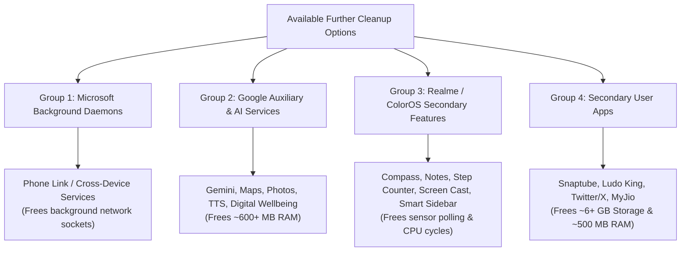

# Read-Only Audit: Remaining Candidates for Further Cleaning
**Target Device:** Realme RMX5011 (Qualcomm SM8750 • 12 GB RAM • 256 GB Storage • Android 16)

---

## 1. Overview & Architecture

---

## 2. Group 1: Microsoft Windows Link Daemons *(Low-Hanging Fruit)*
These run continuously in the background scanning your local Wi-Fi and Bluetooth for nearby Windows PCs:
* **`com.microsoft.appmanager`** *(Link to Windows / Phone Link)*
* **`com.microsoft.deviceintegrationservice`**
* **`com.microsoftsdk.crossdeviceservicebroker`**
* **Gain:** Shuts down 3 continuous background network/Bluetooth polling listeners.

---

## 3. Group 2: Google Auxiliary & AI Modules *(Big RAM Gain)*
* **Google TTS Engine (`com.google.android.tts`):** Currently holding **~218 MB RAM** alone.
* **Google Gemini AI (`com.google.android.apps.bard`):** Cloud AI assistant.
* **Google Maps (`com.google.android.apps.maps`):** Background location polling and route tracking.
* **Google Photos (`com.google.android.apps.photos`):** Uses **~2.0 GB storage** and **~219 MB RAM** for media scanning.
* **Digital Wellbeing (`com.google.android.apps.wellbeing`):** Continuously logs every single app switch and screen unlock.
* **Google Lens & ARCore (`com.google.ar.lens`, `com.google.ar.core`)**
* **Android Auto (`com.google.android.projection.gearhead`)**
* **Google Docs & Google Wallet (`apps.docs`, `apps.walletnfcrel`)**
* **Gain:** **Frees ~600–800 MB of physical RAM** and stops Google activity logging.

---

## 4. Group 3: Realme / ColorOS Secondary Tools *(Zero-Risk)*
Built-in utility apps that run idle services:
* **`com.oplus.healthservice`:** Constantly polls accelerometer/pedometer hardware for step tracking.
* **`com.oplus.cast`:** Screen casting daemon.
* **`com.oplus.multiapp`:** App cloner service.
* **`com.coloros.smartsidebar` & `floatassistant`:** Floating sidebar/ball overlay listeners.
* **`com.coloros.compass2`, `soundrecorder`, `calculator`, `video`:** Stock tools with potential online integration.
* **`com.realme.smartdrive` & `com.realme.movieshot`**
* **`com.oplus.omoji` & `com.oplus.ambient.livealert`**
* **Gain:** Eliminates sensor polling wakeups and reduces background process clutter.

---

## 5. Group 4: Secondary User Apps *(Storage & RAM Heavy)*
* **Snaptube (`com.snaptube.premium`):** Uses **~4.5 GB storage** and **~215 MB RAM** in the background.
* **Twitter / X (`com.twitter.android`):** Uses **~1.2 GB storage**.
* **Ludo King (`com.ludo.king`)**
* **MyJio (`com.jio.myjio`):** Runs background account sync and promotional push notifications.
* **Facebook (`com.facebook.katana`):** Uses **~301 MB RAM** in the background.

---

## 6. Estimated Total Potential Gains
* **Potential RAM Freed:** **~1.0 to 1.4 GB** additional physical RAM.
* **Potential Storage Freed:** **~6 to 8 GB** storage (if secondary apps/caches are cleaned).
* **System State:** Ultra-clean, minimal, and fully dedicated to **BGMI, WhatsApp, Camera, and Core System Operations**.
