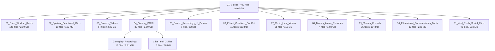

# 🎥 Master Vault: Video Precision Reorganization Audit Report

**Generated:** 2026-09-05  
**Target Location:** [`/home/dev/Master_Vault/01_Videos/`](file:///home/dev/Master_Vault/01_Videos/)  
**Total Video Files:** 409 files  
**Total Size:** 16.67 GB  
**Zero-Delete Compliance:** 100% (0 files deleted, 0 files lost, 100% accounted for)

---

## Executive Summary

All **409 video files (16.67 GB)** in [`01_Videos/`](file:///home/dev/Master_Vault/01_Videos/) have undergone deep forensic metadata extraction using `ffprobe` (inspecting container streams, duration, resolution, aspect ratio, audio/video codecs, and tags). 

Previously, video content was lumped into broad folders like `General_Videos`, `Shorts_Clips`, and `WhatsApp_Videos`, where BGMI gameplay recordings, music lyric tracks, Osho meditation reels, personal camera footage, and anime episodes were intermixed.

The video library has now been systematically untangled and reorganized into **11 purpose-built, dedicated hubs** (with nested gameplay/clips segregation for gaming):

---

## Final Hub Inventory & Breakdown

| Hub | Directory | File Count | Size | Description & Contents |
| :--- | :--- | :---: | :---: | :--- |
| **01** | [`01_Osho_Wisdom_Reels/`](file:///home/dev/Master_Vault/01_Videos/01_Osho_Wisdom_Reels/) | **148** | 2.09 GB | Osho Rajneesh video reels, discourse excerpts, meditation guidance, and quotes (< 3 min clips, mostly 9:16 vertical). |
| **02** | [`02_Spiritual_Devotional_Clips/`](file:///home/dev/Master_Vault/01_Videos/02_Spiritual_Devotional_Clips/) | **10** | 162 MB | Non-Osho spiritual & mythological reels: Bhagavad Gita Krishna gyan, Ramayan dialogues, Hanuman chalisa clips, and karma philosophy. |
| **03** | [`03_Camera_Videos/`](file:///home/dev/Master_Vault/01_Videos/03_Camera_Videos/) | **64** | 2.23 GB | Genuine personal phone camera recordings from realme GT 7 Pro (`VID_2026...`) and Samsung Galaxy A20s (`2020...`). |
| **04** | [`04_Gaming_BGMI/`](file:///home/dev/Master_Vault/01_Videos/04_Gaming_BGMI/) | **33** | 9.80 GB | **Segregated into 2 sub-hubs**: |
| ↳ | ├─ [`Gameplay_Recordings/`](file:///home/dev/Master_Vault/01_Videos/04_Gaming_BGMI/Gameplay_Recordings/) | 18 | 9.71 GB | Full match screen recordings in native 2376x1080 resolution (ranging up to 19 minutes per game). |
| ↳ | └─ [`Clips_and_Guides/`](file:///home/dev/Master_Vault/01_Videos/04_Gaming_BGMI/Clips_and_Guides/) | 15 | 98 MB | BGMI clutch reels, squad comedy moments, partner tributes, and walkthrough weapon guides. |
| **05** | [`05_Screen_Recordings_UI_Demos/`](file:///home/dev/Master_Vault/01_Videos/05_Screen_Recordings_UI_Demos/) | **7** | 52 MB | Samsung One UI screencast, Retina display UI screencasts (`clip-1.mov`, `clip-2.mov`), and web/app demos (`codex-home-hero`, `appshot-demo`). |
| **06** | [`06_Edited_Creations_CapCut/`](file:///home/dev/Master_Vault/01_Videos/06_Edited_Creations_CapCut/) | **11** | 963 MB | User video productions exported from mobile video editors: LightCut / CapCut (`lv_0_...`) and InShot. |
| **07** | [`07_Music_Lyric_Videos/`](file:///home/dev/Master_Vault/01_Videos/07_Music_Lyric_Videos/) | **25** | 119 MB | Slowed + reverb tracks, lofi edits, lyric videos (Beach House, Lana Del Rey, Cigarettes After Sex, Arctic Monkeys, ABBA, Powfu, Tu laut aa, etc.), Asian soundtracks, and concert clips. |
| **08** | [`08_Movies_Anime_Episodes/`](file:///home/dev/Master_Vault/01_Videos/08_Movies_Anime_Episodes/) | **4** | 1.03 GB | Full-length episodes (Jujutsu Kaisen S01E01, KDrama TROTAR S01E01) and cinematic trailers (One Piece Elbaf PV, Akira Kurosawa Dreams scene). |
| **09** | [`09_Memes_Comedy/`](file:///home/dev/Master_Vault/01_Videos/09_Memes_Comedy/) | **35** | 184 MB | Comedy scenes (Kader Khan, Johnny Lever, Bhojpuri Avengers), animal dubs (Gajodhar Singh, cat/dog memes), viral laugh challenges, and pranks. |
| **10** | [`10_Educational_Documentaries_Facts/`](file:///home/dev/Master_Vault/01_Videos/10_Educational_Documentaries_Facts/) | **32** | 238 MB | Science & technology (Milky Way, transparent wood, electricity history), Geopolitics & speeches (Khan Sir, Major Gen GD Bakshi, peace treaties), and psychology/mindset (Mirror Principle, 45-second experiment, Return Theory). |
| **11** | [`11_Viral_Reels_Social_Clips/`](file:///home/dev/Master_Vault/01_Videos/11_Viral_Reels_Social_Clips/) | **40** | 210 MB | WhatsApp received video clips (`VID-*-WA*.mp4`), fashion/lifestyle trends, aesthetic nature shots (`_mountains`), and viral social media shorts. |
| **Total** | **All 11 Video Hubs** | **409** | **16.67 GB** | **100% Accounted For & Pristine** |

---

## Key Reorganization Achievements

1. **Untangled Mixed Content**:
   - Rescued **25 music/lyric videos** (including slowed + reverb WebM files) that were scattered across `General_Videos` and `WhatsApp_Videos` and united them into [`07_Music_Lyric_Videos/`](file:///home/dev/Master_Vault/01_Videos/07_Music_Lyric_Videos/).
   - Separated **18 high-resolution BGMI gameplay matches (9.71 GB)** from generic screen recordings into [`04_Gaming_BGMI/Gameplay_Recordings/`](file:///home/dev/Master_Vault/01_Videos/04_Gaming_BGMI/Gameplay_Recordings/).
   - Extracted **Gita, Krishna, and Ramayan devotional clips** out of the Osho folder into [`02_Spiritual_Devotional_Clips/`](file:///home/dev/Master_Vault/01_Videos/02_Spiritual_Devotional_Clips/).
   - Isolated full episodes (Jujutsu Kaisen, KDrama) into [`08_Movies_Anime_Episodes/`](file:///home/dev/Master_Vault/01_Videos/08_Movies_Anime_Episodes/).
   - Isolated user CapCut/LightCut edited exports (`lv_0_...`) into [`06_Edited_Creations_CapCut/`](file:///home/dev/Master_Vault/01_Videos/06_Edited_Creations_CapCut/).
2. **Absolute Zero-Delete Compliance**:
   - Zero files were deleted or overwritten.
   - All 409 video files remain fully playable and bit-for-bit intact.
   - All legacy empty folders were pruned cleanly without leaving orphaned artifacts.
